# Smart UI — Themeable Infotainment Panel (Qt 6 / QML)

A production-shaped Qt Quick application that recreates a modern automotive infotainment control panel with full **light + dark** theming, reusable components, and module-based imports. Designed with glanceable UI principles for safe, intuitive in-car interaction.

---

## Screenshots

### Home Dashboard — Quick Controls Widget
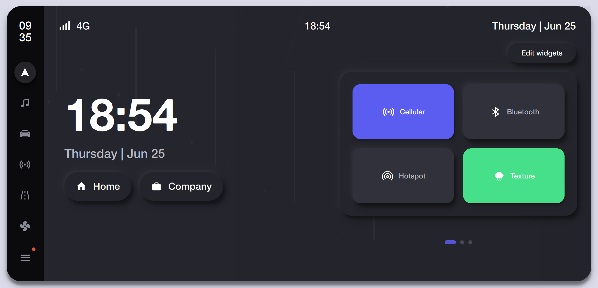
The main home screen featuring a large clock display, date, and quick-access location shortcuts. The right panel shows an editable widget area with connectivity toggles for Cellular, Bluetooth, Hotspot, and Weather Texture controls.

---

### Home Dashboard — Weather Widget
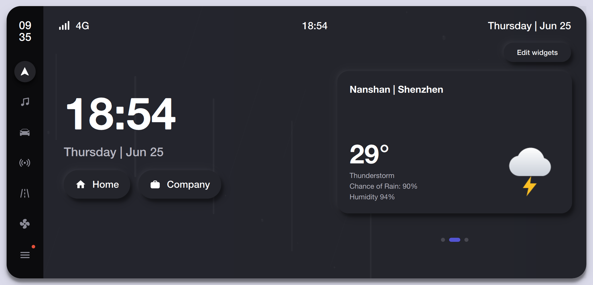
Home screen configured with the live weather widget displaying real-time conditions for Nanshan, Shenzhen — including current temperature, weather description, rain probability, and humidity sourced from the Open-Meteo API.

---

### Weather Detail — 5-Day Forecast
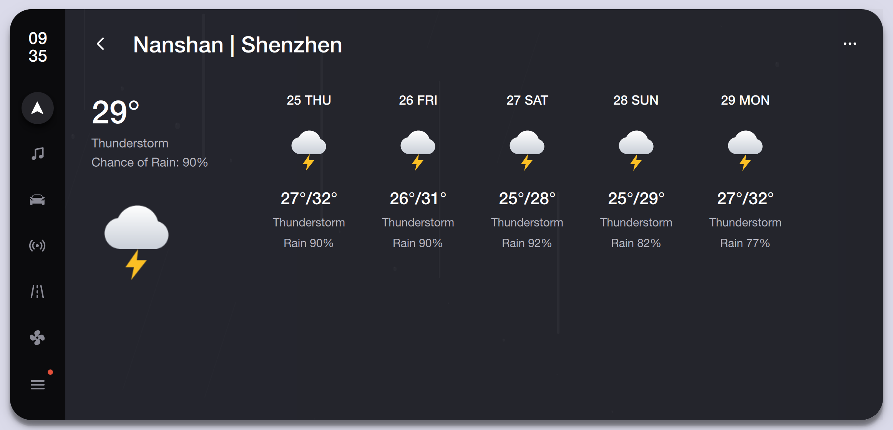
Expanded weather detail view showing the current conditions alongside a 5-day forecast with daily high/low temperatures, weather descriptions, and precipitation probabilities for at-a-glance trip planning.

---

### Music — Browse Library
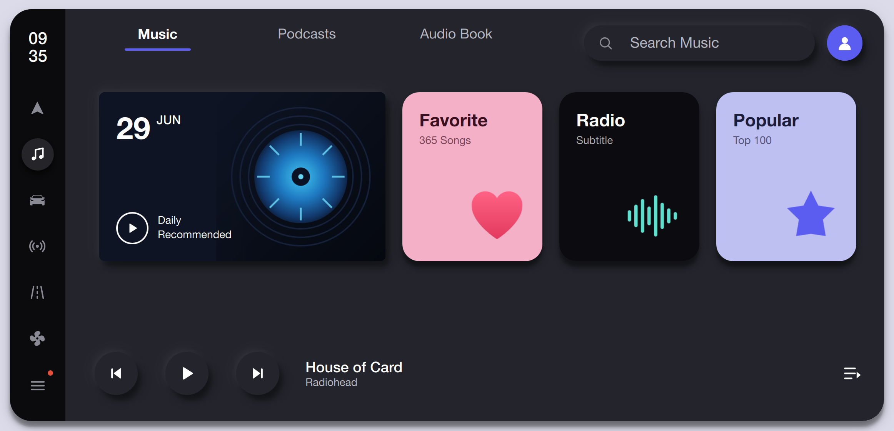
The music browse screen with category tabs for Music, Podcasts, and Audio Books. Features curated sections including Daily Recommended, Favorites, Radio, and Popular playlists with album artwork and a persistent now-playing bar at the bottom.

---

### Music — Now Playing
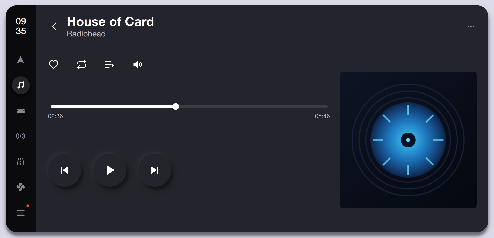
Full now-playing screen with track details, playback progress scrubber, transport controls (previous, play/pause, next), and quick-action buttons for favorite, repeat, queue, and volume. Album artwork is displayed prominently on the right.

---

### Vehicle Control — Controls Tab
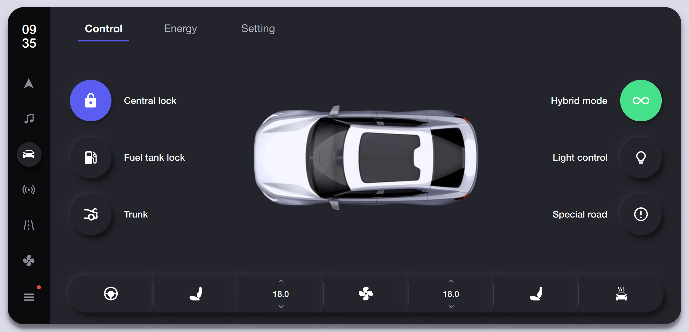
Vehicle control panel showing a top-down car visualization with toggles for Central Lock, Fuel Tank Lock, Trunk, Hybrid Mode, Light Control, and Special Road mode. The bottom bar provides quick access to climate temperature zones.

---

### Vehicle Control — Energy Tab
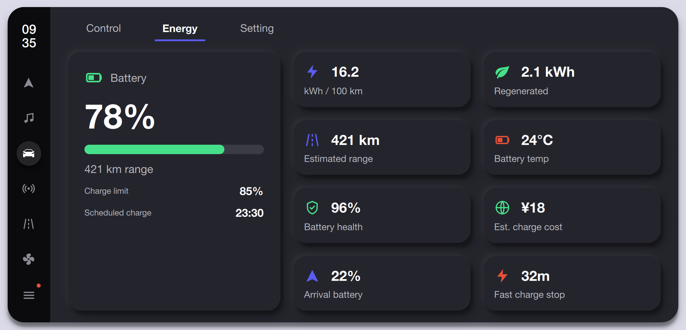
EV energy management dashboard displaying battery state at 78% with 421 km range. Includes detailed metrics: energy consumption, regeneration, estimated range, battery temperature, health, charge cost estimate, arrival battery projection, and fast-charge stop summary.

---

### Vehicle Control — Settings Tab
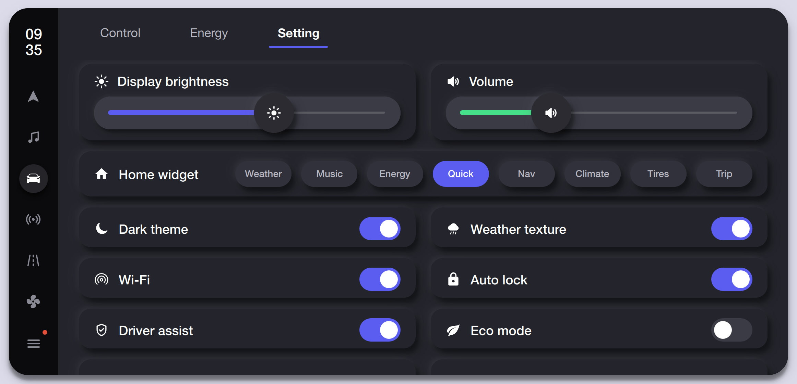
System settings panel with sliders for display brightness and volume, a home widget selector (Weather, Music, Energy, Quick, Nav, Climate, Tires, Trip), and persisted toggles for Dark Theme, Weather Texture, Wi-Fi, Auto Lock, Driver Assist, and Eco Mode.

---

### Quick Settings Panel
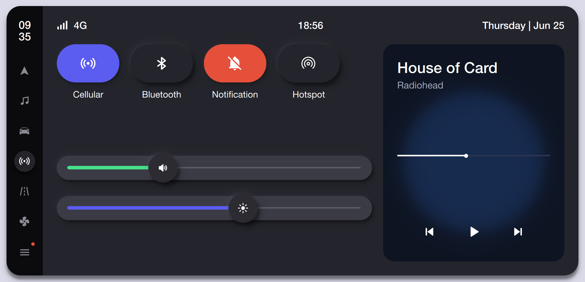
Pull-down quick settings overlay with connectivity toggles (Cellular, Bluetooth, Notification, Hotspot), system volume and brightness sliders, and a compact now-playing card with inline transport controls for hands-free media management.

---

### Navigation Screen
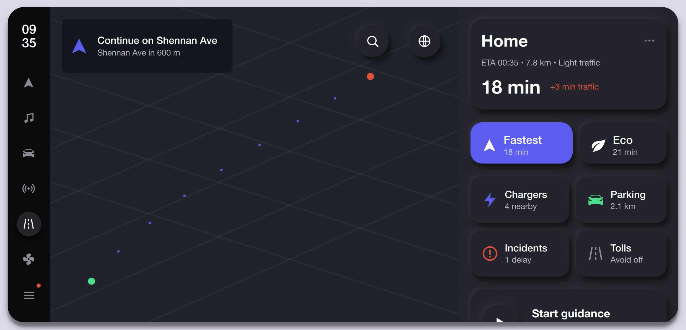
Dedicated navigation view featuring a map display with route guidance, turn-by-turn directions, and a route summary panel showing destination, ETA, distance, and traffic conditions. Includes route mode selection (Fastest vs Eco), nearby chargers, parking, incidents, tolls, and a start-guidance action button.

---

### Climate Control
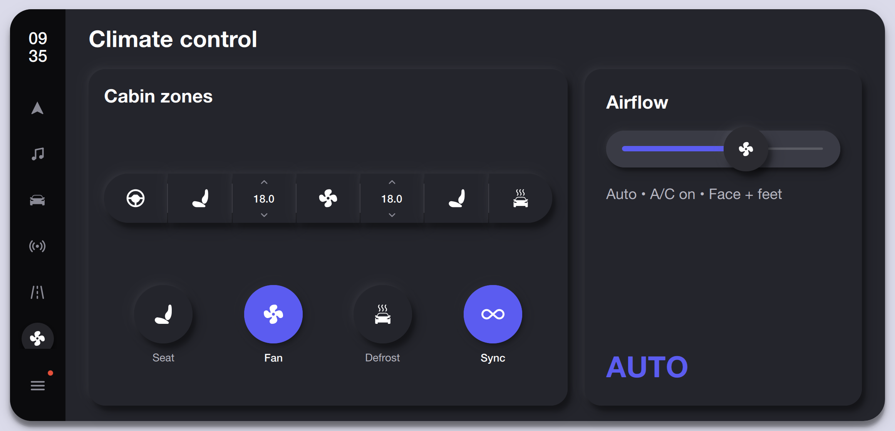
Dual-zone climate control interface with independent temperature settings for driver and passenger zones. Features airflow intensity slider, mode indicators (Auto, A/C, Face + Feet), and quick-access controls for Seat heating, Fan speed, Defrost, and Zone Sync.

---

### Notifications Center
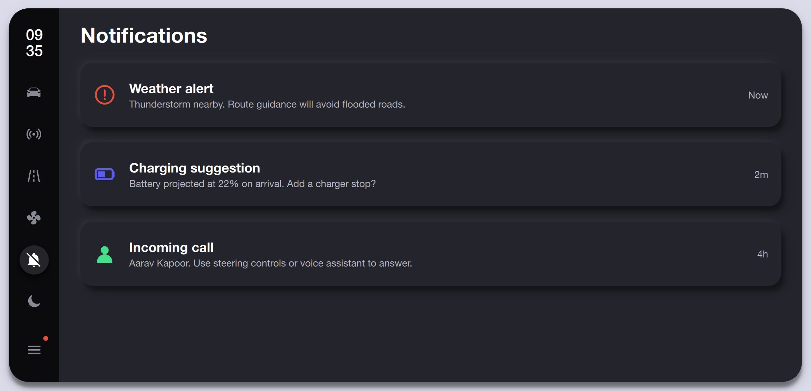
Centralized notification feed displaying prioritized alerts — weather warnings, charging suggestions, and incoming call notifications — each with contextual details and timestamps for safe, at-a-glance awareness while driving.

---

### Theme Studio — System Controls
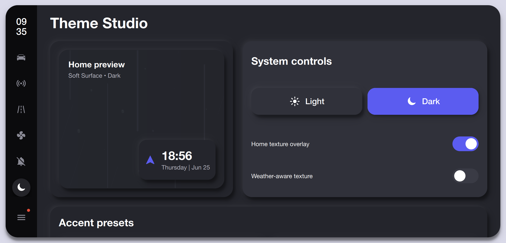
Theme customization screen with a live home preview panel, Light/Dark mode selector, and toggles for Home Texture Overlay and Weather-Aware Texture. Provides real-time visual feedback as theme settings are adjusted.

---

### Theme Studio — Accent Presets
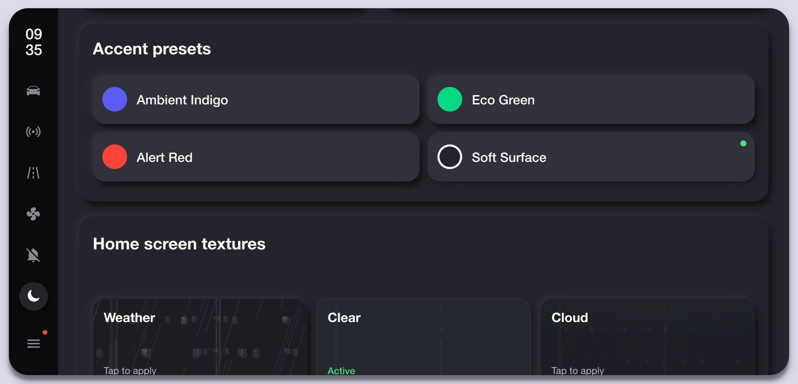
Accent color customization with preset options including Ambient Indigo, Eco Green, Alert Red, and Soft Surface. Each preset applies a coordinated color scheme across the entire interface for a cohesive visual identity.

---

### Theme Studio — Home Screen Textures
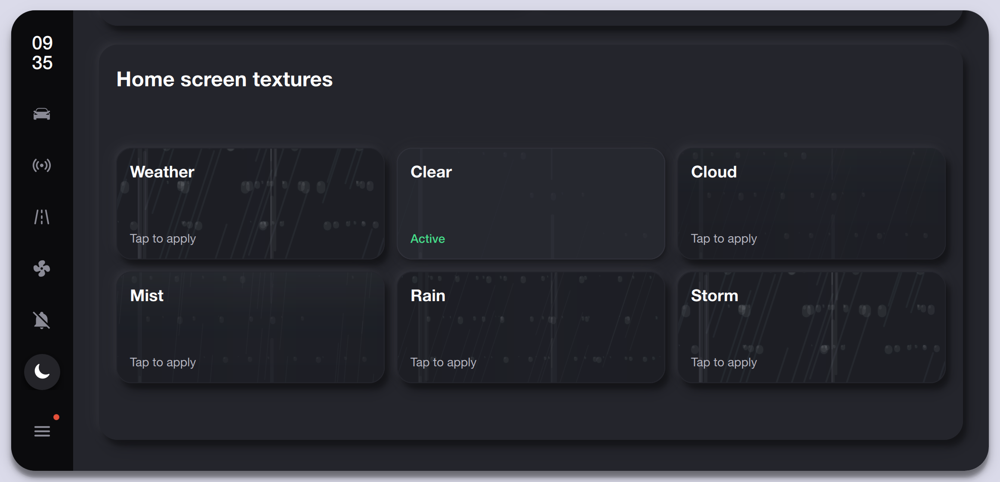
Texture pack gallery for the home screen background, offering six atmospheric options — Weather, Clear, Cloud, Mist, Rain, and Storm — with tap-to-apply activation and an active state indicator.

---

### App Launcher
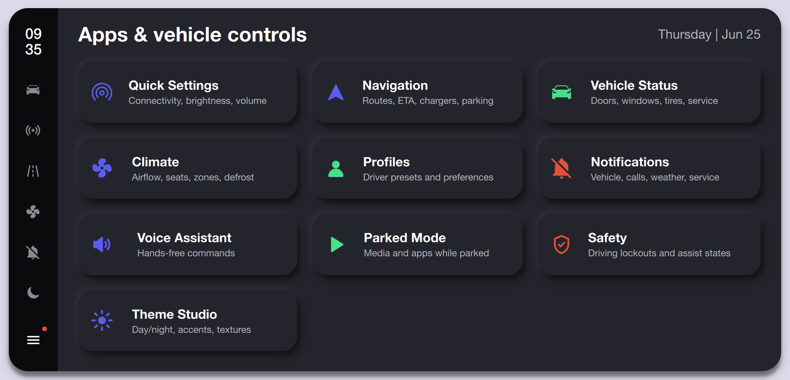
Full app launcher grid providing direct access to all system modules: Quick Settings, Navigation, Vehicle Status, Climate, Profiles, Notifications, Voice Assistant, Parked Mode, Safety, and Theme Studio — each with a descriptive subtitle.

---

### Voice Assistant
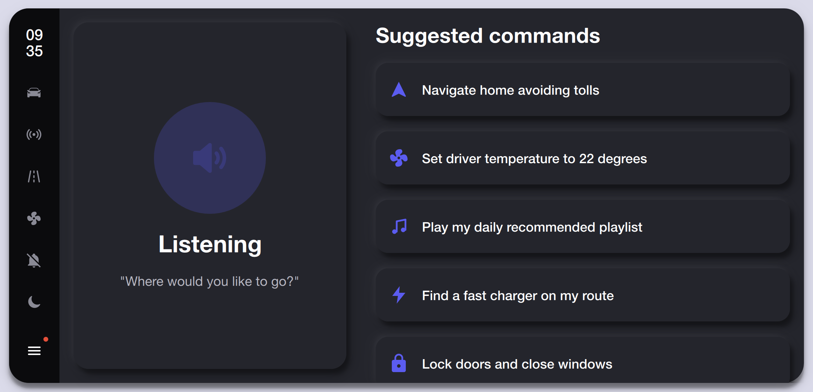
Hands-free voice assistant screen in active listening state with a visual audio indicator and contextual prompt. Displays suggested commands for common actions: navigation, climate control, media playback, charger search, and vehicle security.

---

### Safety States
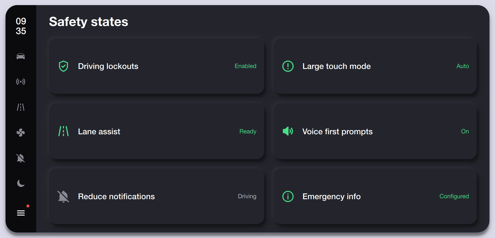
Driving safety configuration panel showing the status of key safety features: Driving Lockouts, Large Touch Mode, Lane Assist, Voice First Prompts, Reduce Notifications, and Emergency Info — each with clear enabled/ready/configured state indicators.

---

### Driver Profiles
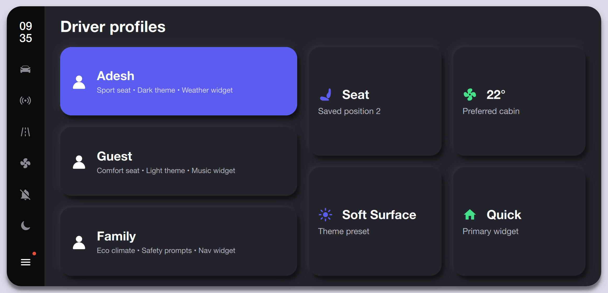
Multi-user profile management screen with saved presets for seat position, climate preferences, theme, and home widget selection. The active profile (Adesh) is highlighted, with Guest and Family profiles available for quick switching.

---

### Vehicle Status
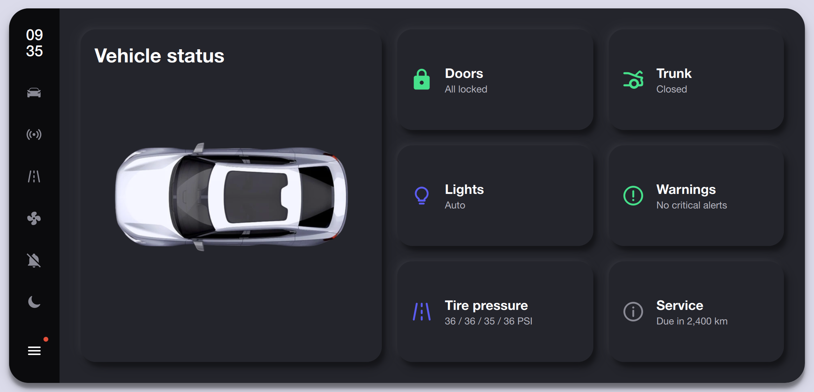
Comprehensive vehicle status overview featuring a top-down car diagram with real-time status cards for Doors, Trunk, Lights, Warnings, Tire Pressure (individual PSI readings), and Service schedule — providing a complete vehicle health snapshot.

---

### Climate Control — Full View

Full-screen climate control layout showing the complete cabin zone configuration with dual-zone temperature controls, airflow direction and intensity management, and one-tap toggles for seat heating, fan, defrost, and zone sync functions.

---

### Parked Mode
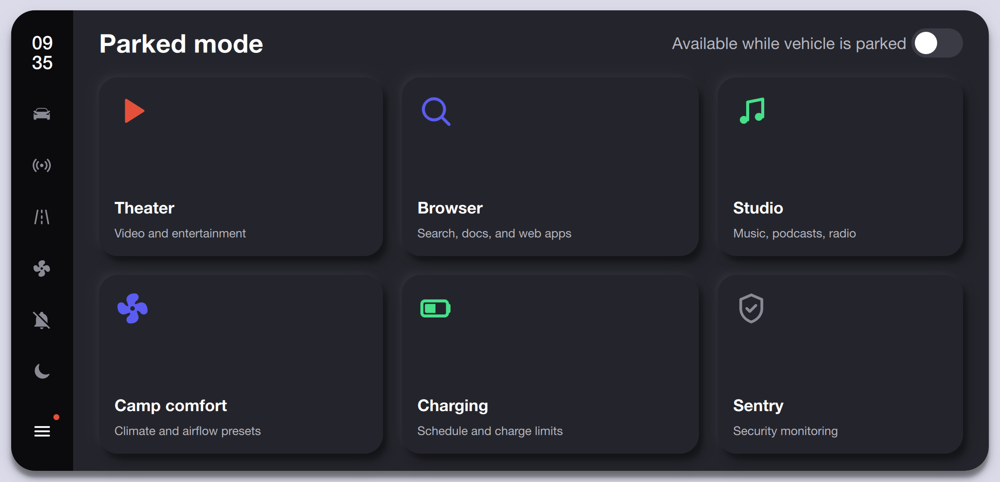
Parked-only entertainment and utility dashboard unlocked when the vehicle is stationary. Offers Theater, Browser, Studio (music/podcasts), Camp Comfort (climate presets), Charging management, and Sentry (security monitoring) tiles.

---

## Key Features

- **Dual Theming** — Fully implemented light and dark modes with persisted preference via `QSettings`.
- **Live Data** — Real-time clock, date, and Open-Meteo weather integration with 5-day forecast.
- **Modular Widgets** — Swappable home screen widget with 8 options (Weather, Music, Energy, Quick Controls, Navigation, Climate, Tires, Trip).
- **Complete Vehicle Controls** — Lock, lights, trunk, hybrid mode, and climate zones.
- **EV Energy Dashboard** — Battery status, range estimation, charge scheduling, health, and cost tracking.
- **Navigation** — Route guidance with ETA, traffic, charger/parking/incident/toll overlays.
- **Media Player** — Browse library with categories, full now-playing controls, and persistent mini-player.
- **Theme Studio** — Accent presets, texture packs, and weather-aware dynamic backgrounds.
- **Driver Profiles** — Per-user seat, climate, theme, and widget layout presets.
- **Safety System** — Driving lockouts, large touch mode, lane assist, and do-not-disturb controls.
- **Voice Assistant** — Listening state UI with contextual command suggestions.
- **Parked Mode** — Entertainment and utility apps gated to stationary vehicle state.

## Architecture

```
smartuidesign/
├── main.cpp                     # registers Theme & Icons singletons, adds qrc:/qml import path
├── main.qml                     # Window -> InfotainmentScreen
├── qml.qrc                      # all QML, qmldir and icon assets
├── icons/                       # monochrome SVGs, recoloured at runtime
└── qml/App/
    ├── Theme/Theme.qml          # design tokens: colors (light/dark), typography, metrics, motion
    ├── Icons/Icons.qml          # central icon-path registry
    ├── Components/              # module App.Components (reusable controls)
    │   ├── AppIcon  Surface  ToggleTile  ValueSlider
    │   ├── TransportButton  NowPlayingCard  SideRail
    │   └── StatusBar  ThemeToggle
    ├── Controllers/             # module App.Controllers
    │   └── SystemController.qml # view-model holding UI state
    └── Screens/                 # module App.Screens
        └── InfotainmentScreen.qml
```

### Theming
`Theme` is a single source of truth registered from C++:

```cpp
engine.addImportPath("qrc:/qml");
qmlRegisterSingletonType(QUrl("qrc:/qml/App/Theme/Theme.qml"), "App.Theme", 1, 0, "Theme");
qmlRegisterSingletonType(QUrl("qrc:/qml/App/Icons/Icons.qml"),  "App.Icons", 1, 0, "Icons");
```

Because they are registered here, `Theme.qml` / `Icons.qml` are plain
`QtObject`s (no `pragma Singleton`, no qmldir entry). Every colour binding reads
`Theme.colors.*`, so switching the whole UI is one write:

```qml
Theme.dark = false        // or Theme.toggle()
```

### Module imports (no `../`)
Component folders ship a `qmldir` (e.g. `module App.Components`) and the resource
root is on the import path, so files import by module name:

```qml
import App.Theme
import App.Icons
import App.Components
```

### Icons
SVGs are authored as solid black shapes on transparent ground; `AppIcon` recolours
them to any theme token via `MultiEffect.colorization`, so one asset serves both
themes.

### State
`SystemController` keeps UI state (toggles, slider values, track, network) out of
the views; `InfotainmentScreen` instantiates one and binds controls to it — easy
to later swap for a C++-backed model.

## Build & Run

Qt 6.7+ (uses `QtQuick.Effects`, per-corner `Rectangle` radius). qmake:

```bash
qmake6 smartuidesign.pro && make && ./smartuidesign
```

or open `smartuidesign.pro` in Qt Creator and Run.

## Product Roadmap

### High Priority Next

- Home widget editor with drag/reorder, widget size presets, and live preview.
- Multiple Home widget slots instead of only one right-side widget.
- Real map SDK integration with turn-by-turn route geometry and live traffic.
- Real vehicle signal binding for doors, tires, lights, climate, charging, and warning states.
- Persist driver profiles and home widget layouts through `QSettings`.
- Real media queue/library data and connected call/message notification data.

### Medium Priority

- Voice command recognition and hands-free command execution.
- True parked-mode gating using vehicle speed/gear state.
- Real browser/video app integration for parked mode.
- Theme presets with saved accent/wallpaper/texture combinations.
- Side navigation redesign: active indicators, badges, long-press shortcuts.
- Calendar/commute widget and calls/messages widgets.
- Accessibility pass: contrast, touch targets, focus order, reduced motion.
